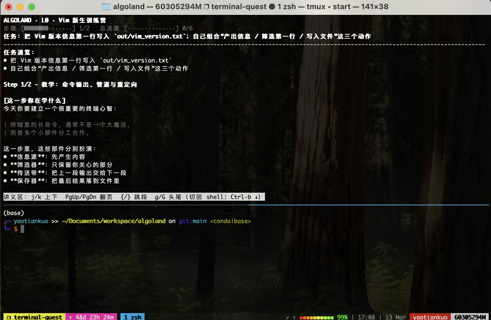

<div align="center">

# AlgoLand

[English](./README.md) · **中文**

<p>
  <strong>一个给算法同学边玩边学的终端入门世界。</strong><br/>
  在真实终端里学习 terminal、Git、Python 环境、PDB、SSH 和 LLM API。
</p>

<p>
  <a href="#快速开始">快速开始</a> ·
  <a href="#你会学到什么">学习内容</a> ·
  <a href="#截图--预览">预览图</a> ·
  <a href="./README.md">English</a>
</p>

<p>
  
  
  
</p>

</div>

---

## AlgoLand 是什么？

AlgoLand 是一个面向算法工程师和研究实习生的开源终端闯关项目。
它不是让你先啃一大堆文档，而是让你：
**直接进入一个可玩的终端世界，在上半屏看讲义，在下半屏修改代码、执行命令、一步步过关。**

它适合这样的人：
- 刚开始接触终端工作流
- 不喜欢被动看文档，更喜欢边做边学
- 更擅长通过 debug、patch 现有代码来理解系统
- 想更快进入真实工程基础能力

## 为什么它更像“玩”而不是“上课”

| 传统 onboarding | AlgoLand |
|---|---|
| 先读大量文档 | 先进入世界开始玩 |
| 静态说明 | 上半屏讲义 + 下半屏实操 |
| 玩具示例 | 真正的 patch / debug 任务 |
| 延迟反馈 | 每步即时验收 |

## 你会学到什么

1. **L0 — Vim + 终端基础**
2. **L1 — Terminal + Git**
3. **L2 — Python 环境**
4. **L3 — PDB 排障**
5. **L4 — SSH 基础**
6. **L5 — LLM API 基础**

## 截图 / 预览

> 下面这个位置已经预留给截图或 GIF。  
> 建议图片路径：`assets/algoland.png`

<p align="center">
  
</p>

推荐放这些画面：
- 启动画面
- 上半屏讲义 + 下半屏 shell
- 正在修代码并提交过关的过程

## 快速开始

```bash
./start
```

如果没有保留可执行权限：

```bash
bash start
```

启动后系统会先询问：
- 语言（中文 / English）
- 是否 `Resume` 继续上次进度
- 或 `New game` 从头开始

也可以显式指定：

```bash
./start --resume
./start --fresh
```

## 操作方式

**讲义区**
- `j / k`：上下滚动
- `PgUp / PgDn`：翻页
- `{ / }`：按段跳转
- `g / G`：跳到头尾

**tmux pane 切换**
- `Ctrl-b` 然后 `↑`：切到上半屏
- `Ctrl-b` 然后 `↓`：切回下半屏

**常用命令**
```bash
./quest submit
./quest status
./quest goto L3 1
./quest reset
```

## 依赖

- `podman`
- `tmux`
- `git`（推荐）

macOS 示例：

```bash
brew install podman tmux git
```

## 设计理念

AlgoLand 想模拟更真实的学习方式：
- 看懂任务
- 改已有东西
- 真实运行
- 观察结果
- 一步步升级

所以关卡会尽量：
- 讲清楚原理
- 不直接把完整答案喂给你
- 降低新手恐惧感
- 让你通过 patch 和 debug 真正学会
